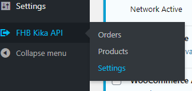
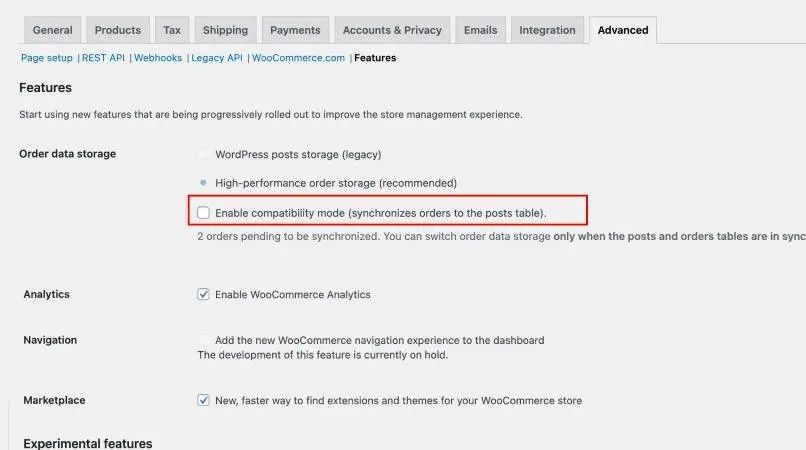
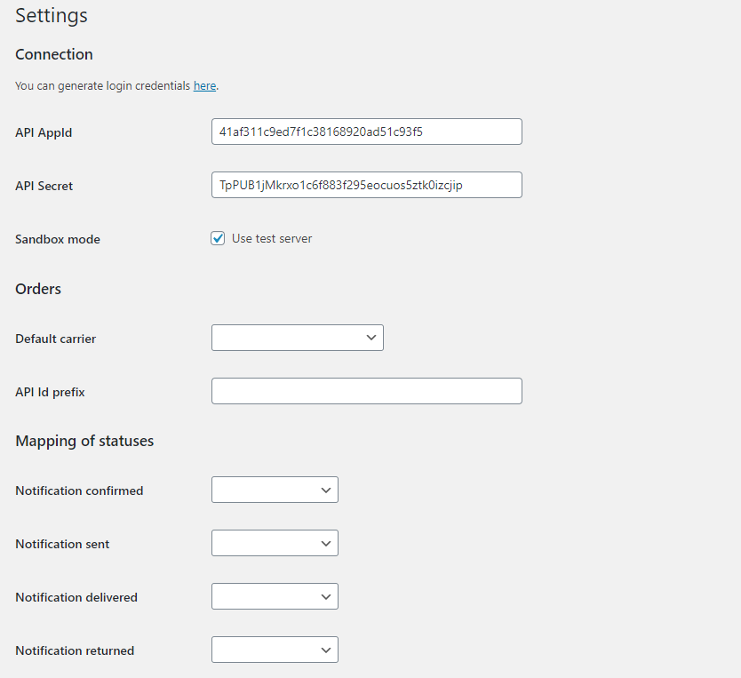
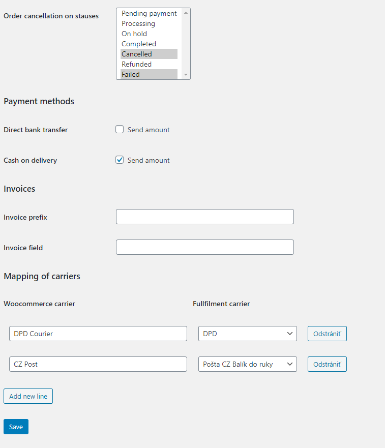
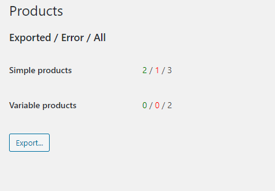
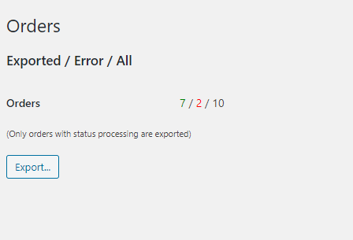
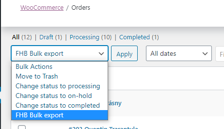

# Fullfilment by FHB - woocommerce plugin (version 3.33)
Plugin for integration woocommerce store with ZOE fullfilment system

Čítaj tiež po [Slovensky](readme.sk.md)

## Contents
  - [Instalation](#instalation)
  - [HPOS compatibility](#high-performance-order-storage-hpos-compatibility)
  - [Settings](#settings)
  	- [Connection](#connection)
  	- [Orders](#orders)
  	- [Mapping of statuses](#mapping-of-statuses)
  	- [Payment methods](#payment-methods)
  	- [Invoices](#invoices)
  	- [Mapping of carriers](#mapping-of-carriers)
  - [Exporting](#exporting)
    - [Products](#exporting-of-products)
    - [Orders](#exporting-of-orders)
  - [Stock sync](#stock-sync)
  - [Hooks](#hooks)

### Instalation
- it is possible to install plugin unzipping directly to plugins folder, or import ZIP archive in plugins section of woocommerce
- activation in Plugins section

- after activation, new item appears in menu, named FHB Kika API

### High-Performance Order Storage (HPOS) Compatibility
From WooCommerce 8.2, released on October 2023, High-Performance Order Storage (HPOS) is officially flagged as stable and will be enabled by default for new installations.

Versions 3.27 and above are HPOS compatible.

Older versions must have Compatibility mode enabled for correct function of plugin.

More details available [HERE](https://woo.com/document/high-performance-order-storage/!)

### Settings

#### Connection
- API AppId + API Secret - values generated in ZOE system, for pairing with ZOE account
- Sandbox Mode - checkbox, indicates if plugin is connected to production, or test system. Checked if connected to test system
- Stock sync - checkbox, activates hourly synchronization of stock levels from ZOE (see [Stock sync](#stock-sync)). Available only when stock management is enabled in WooCommerce

#### Orders
- default carrier - optional, default carrier that will be assigned to order
- Prefix API Id - prefix for order ID, necessary to fill with different values if multiple plugins are connected to the same ZOE account
- Ignore product prefix - products whose SKU starts with this string will be ignored
- Ignored countries - comma separated list of country codes that will be ignored
- Group orders - all orders with the same name, city and email withing the same export are merged together

#### Mapping of statuses
Changes woocommerce order status when order change happen in fullfilment center.

- Notification confirmed - set status when order processing started
- Notification sent - set status when order is sent (usually set to Completed)
- Notification returned - set status when order is returned

- Order cancellation on statuses - when order status change to one of selected status, plugin tries to cancell order from ZOE system. Order cancellation is possible only when order processing have not started yet (order has pending status)

#### Payment methods
Setting of COD payments. For selected payment methods, plugin send COD amount to ZOE system.

#### Invoices
Setting for sending invoice to ZOE system (only when invoice should be printed and attached to order).
Plugin creates invoice URL from following 2 fields
- Invoice field - order custom field that contains invoice URL, or file name
- Invoice prefix - if "Invoice field" contains only name of file, there should be path where file is located

#### Mapping of carriers
Setting for mapping woocommerce carriers to carriers in ZOE system.

### Exporting
For proper integration, products must be exported before sending actual orders!

#### Exporting of products

- tab is used for an overview and bulk export of product to the ZOE system
- it is possible to export product individually in product detail
- every simple product must have set unique SKU. It can be set up in product detail -> inventory -> SKU
- for variable products, every variant must have unique SKU (every variant is created as separate product in ZOE). Variable product variant can be set up in product detail -> variantions (expand variation) -> SKU

#### Exporting of orders

- overview and bulk export orders from system
- only unexported orders, in processing status, older than 10 minutes and newer than 2 days are exported
- order can be also exported individually in order detail, cod amount and carrier can be specifically set

Bulk export of orders is also possible via bulk action "FHB Bulk export" on Orders overview page. 
All unexported marked orders will be exported.

### Stock sync
Plugin can keep WooCommerce stock levels in sync with stock in ZOE fulfillment center. Requires stock management enabled in WooCommerce (WooCommerce -> Settings -> Products -> Inventory).

- automatic - checkbox "Stock sync" in settings, runs once per hour
- manual - button "Sync stock now" in Products section of plugin (works also when automatic sync is not active)

Stock level of each product is calculated as:

**free quantity in ZOE** (stock minus orders already exported to ZOE) **- quantity of the product in orders not yet exported to ZOE** (orders in processing / on-hold status, whose stock was already reduced by WooCommerce)

- products are paired by SKU
- only products and variations with "Manage stock" enabled directly on them are updated
- stock level is never set below 0
- progress and results are logged into WordPress debug.log with prefix `[Kika StockSync]`

### Hooks
For developers who need to react to fulfillment notifications coming from the ZOE system, plugin fires following WordPress hooks. All hooks receive current `WC_Order` as first parameter.

- `kika_notification_sent` - fired when order was sent from fulfillment center. Second parameter is an array containing `order` (order detail read from ZOE API v3), `shipped_at`, `tracking` (list of tracking numbers), `tracking_links`, `weight` (list of package weights), `parcel_service_code` and `parcel_service` (mapped carrier name, if known)
- `kika_notification_delivered` - fired when order was delivered to customer. Second parameter contains the same data as `kika_notification_sent`, with `delivered_at` instead of `shipped_at`
- `kika_notification_returned` - fired when order was returned to fulfillment center. Second parameter contains the same data as `kika_notification_sent`, without a shipping/delivery date