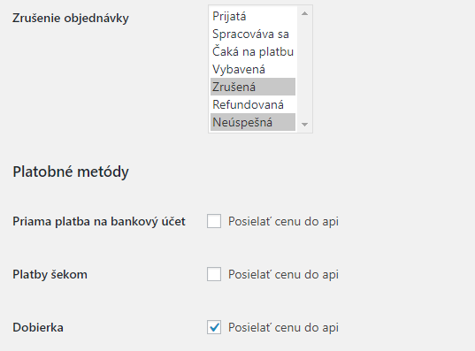

Inštalácia
-----------

- plugin rozbalíme do priečinka wp-content/plugins
- aktivuje sa v sekcii Pluginy

- v menu sa vytvori nova položka FHB Kika API

Záložka nastavenie
------------------

- API AppId a Secret podla zoe
- Sandbox mod - slúži na testovanie. Ak je zapnutý, posiela plugin požiadavky na dev server.
- Default prepravca - vyber štandardného prepravcu. Zoznam sa aktualizuje raz za 7 dní.
- Prefix API ID - pridá prefix k API ID. V prípade ak ma užívateľ viac obchodov aby neprišlo ku kolízii čísiel. 
- Mapovanie statusov - tu sa dajú namapovať Kika API notify linky na Woocomerce statusy. Napr: 
   - Notifikácia confirmed na Spracováva sa
   - Notifikácia sent na Vybavená
   - Notifikácia returned na Zrušenia
- Zrušenie objednávky - nastavenie statusov pri ktorých sa objednávka vymaže zo Zoe. Je možné len v prípade, že je v Zoe v stave Pending.
- Platobné metódy - nastavenie pri ktorej metóde sa posiela suma do API. Defaultne je zapnutá Dobierka
- Faktúry - nastavenie umiestnenia faktúry. Ak nejaký plugin generuje faktúru, a ukladá jej url do parametra objednávky, stačí vyplniť "Pole s faktúrou". Ak sa do tohto poľa ukladá iba názov súboru, tak treba nastaviť aj prefix tohto súboru - vyskladá sa URL faktúry ktorá sa pošle s objednávkou.
- Mapovanie prepravcov - nastavenie mapovania prepravcu vo Woocommerce na prepravcu v fullfilment systéme Kika

Plugin odosiela objednávky pomocou jobu, raz za hodinu. Odosielajú sa všetky objednávky v stave Spracováva sa, ktoré sú vytvorené za posledných 48h a staršie ako 10 min.

Záložka produkty
----------------

- Záložka slúži na prehľad a hromadný export produktov do systému.
- Produkt sa dá alternatívne exportovať v detaile produktu.
- Každý jednoduchý produkt musí mať pred exportom nastavene unikátne SKU. Nastavuje sa v Detail produktu/Údaje o produkte/Sklad/Katalógové číslo

- Pri variabilných produktov musí mať nastavené SKU každá varianta. Nastavuje sa v Detail produktu/Údaje o produkte/Varianty/Katalógové číslo

Záložka objednávky
------------------

- Záložka slúži na prehľad a hromadný export objednávok do systému.
- Exportujú sa neexportované objednávky v stave Spracováva sa, staršie ako 10 min a novšie ako 48h.
- Objednávka sa dá alternatívne exportovať v detaile objednávky, kde sa dajú upraviť tiež parametre exportu ak COD a dopravca.

