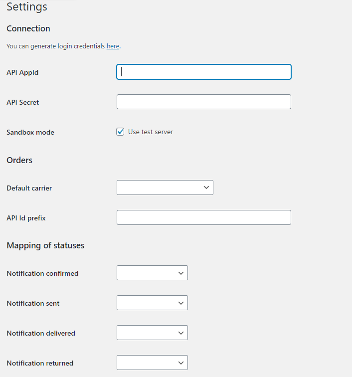
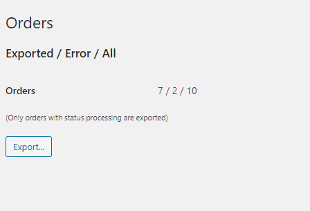
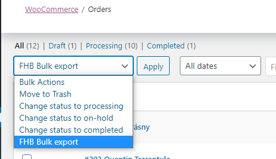

# Fullfilment by FHB - woocommerce plugin (version 3.15)
Plugin for integration woocommerce store with ZOE fullfilment system

Čítaj tiež po [Slovensky](readme.sk.md)

## Contents
  - [Instalation](#instalation)
  - [Settings](#settings)
  	- [Connection](#connection)
  	- [Orders](#orders)
  	- [Mapping of statuses](#mapping-of-statuses)
  	- [Payment methods](#payment-methods)
  	- [Invoices](#invoices)
  	- [Mapping of carriers](#mapping-of-carriers)
  - [Exporting](#exporting)
    - [Products](#exporting-of-products)
    - [Orders](#exporting-of-orders)

### Instalation
- it is possible to install plugin unzipping directly to plugins folder, or import ZIP archive in plugins section of woocommerce
- activation in Plugins section

- after activation, new item appears in menu, named FHB Kika API

### Settings

#### Connection
- API AppId + API Secret - values generated in ZOE system, for pairing with ZOE account
- Sandbox Mode - checkbox, indicates if plugin is connected to production, or test system. Checked if connected to test system

#### Orders
- default carrier - optional, default carrier that will be assigned to order
- Prefix API Id - prefix for order ID, necessary to fill with different values if multiple plugins are connected to the same ZOE account
- Ignore product prefix - products whose SKU starts with this string will be ignored
- Ignored countries - comma separated list of country codes that will be ignored

#### Mapping of statuses
Changes woocommerce order status when order change happen in fullfilment center.

- Notification confirmed - set status when order processing started
- Notification sent - set status when order is sent (usually set to Completed)
- Notification returned - set status when order is returned

- Order cancellation on statuses - when order status change to one of selected status, plugin tries to cancell order from ZOE system. Order cancellation is possible only when order processing have not started yet (order has pending status)

#### Payment methods
Setting of COD payments. For selected payment methods, plugin send COD amount to ZOE system.

#### Invoices
Setting for sending invoice to ZOE system (only when invoice should be printed and attached to order).
Plugin creates invoice URL from following 2 fields
- Invoice field - order custom field that contains invoice URL, or file name
- Invoice prefix - if "Invoice field" contains only name of file, there should be path where file is located

#### Mapping of carriers
Setting for mapping woocommerce carriers to carriers in ZOE system.

### Exporting
For proper integration, products must be exported before sending actual orders!

#### Exporting of products

- tab is used for an overview and bulk export of product to the ZOE system
- it is possible to export product individually in product detail
- every simple product must have set unique SKU. It can be set up in product detail -> inventory -> SKU
- for variable products, every variant must have unique SKU (every variant is created as separate product in ZOE). Variable product variant can be set up in product detail -> variantions (expand variation) -> SKU

#### Exporting of orders

- overview and bulk export orders from system
- only unexported orders, in processing status, older than 10 minutes and newer than 2 days are exported
- order can be also exported individually in order detail, cod amount and carrier can be specifically set

Bulk export of orders is also possible via bulk action "FHB Bulk export" on Orders overview page. 
All unexported marked orders will be exported.

