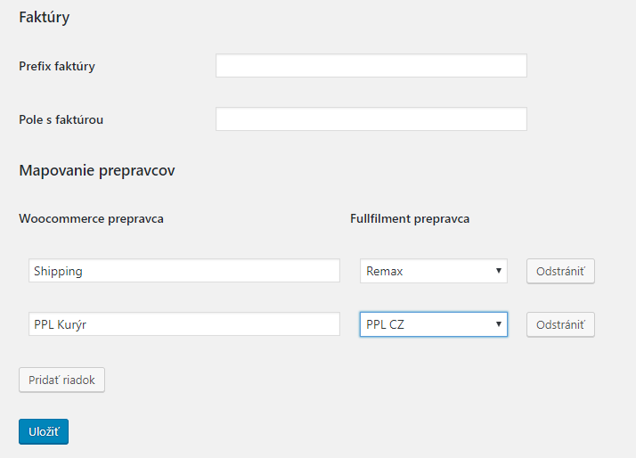

# Fullfilment by FHB - woocommerce plugin (verzia 3.19)
Plugin slúžiaci na prepojenie s woocommerce s fullfilment systémom ZOE

Read this in [English](readme.md)

## Obsah
  - [Inštalácia](#inštalácia)
  - [Nastavenie](#nastavenie)
  	- [Autorizácia](#autorizácia)
  	- [Objednávky](#objednávky)
  	- [Mapovanie statusov](#mapovanie-statusov)
  	- [Platobné metódy](#platobné-metódy)
  	- [Faktúry](#faktúry)
  	- [Mapovanie prepravcov](#mapovanie-prepravcov)
  - [Exportovanie](#exportovanie)
    - [Produkty](#exportovanie-produktov)
    - [Objednávky](#exportovanie-objednávok)

### Inštalácia
- plugin je možné inštalovať rozbalením ZIP archívu do priečinka wp-content/plugins, alebo importovaním v sekcii pluginy
- aktivuje sa v sekcii Pluginy

- po aktivácii sa v menu objaví nová položka FHB Kika API

### Nastavenie
 - nasledovná sekcia obsahuje popis nastavení pluginu pre správnu funkčnosť

#### Autorizácia
- API AppId + API Secret - hodnoty vygenerované v systéme ZOE, určené na spárovanie so zákazníckym účtom
- Sandbox Mode - checkbox, indikuje či je plugin napojený na produkčný alebo testovací účet 

#### Objednávky
- default prepravca - nepovinné, default prepravca ktorý sa prideľuje objednávke
- Prefix API Id - prefix k ID objednávky, nutné vyplniť rôznymi hodnotamiu ak sa používa vo viacerých eshopoch
- Prefix ignorovaného produktu - produkty, ktorých kód (SKU) začína na nastavený reťazec, budú ignorované
- Ignorované krajiny - čiarkou oddelený zoznam kódov krajín, ktoré budú ignorované

#### Mapovanie statusov
Slúži na zmenu statusu objednávky keď sa zmení stav objednávky vo fullfilment centre.

- Notifkácia confirmed - nastaví status keď sa objednávka začne spracovávať
- Notifkácia sent - nastaví status keď bude zásielka odoslaná (obyčajne nastavené na Vybavená)
- Notifkácia returned - nastaví status keď bude objednávka vrátená

- Zrušenie objednávky - u vybraných statusov, slúži na dodatočné vymazanie objednávky. Ak objednávka nadobudne vybrané statusy, plugin sa pokúsi objednávku vymazať zo systému ZOE. Zrušenie objednávky bude úspešné iba ak sa objednávka nezačala spracovávať.

#### Platobné metódy
Nastavenie COD platieb. Pri označených platobných metódach bude plugin posielať plugin dobierkovú sumu do systému ZOE.

#### Faktúry
V prípade že k objednávkam treba tlačiť a prikladať faktúru, je možné použiť toto nastavenie. Slúži na posielanie URL faktúry do systému ZOE.
Pugin z nasledujúcich dvoch polí vytvorí URL faktúry, pod ktorým je prístupný súbor s faktúrou.
- Prefix faktúry - ak je v "Pole s faktúrou" názov súboru, tu treba zadať cestu / zložku, v ktorej je súbor uložený
- Pole s faktúrou - pole objednávky, v ktorom sa chachádza URL na faktúru, resp. názov súboru s faktúrou

#### Mapovanie prepravcov
Slúži na mapovanie Woocommerce prepravcov na prepravcov v systéme ZOE.

### Exportovanie
Popis exportu produktov a objednávok.
Na správne nastavenie integrácie treba po nainštalovaní pluginu exportovať produkty do systému ZOE.

#### Exportovanie produktov

- Záložka slúži na prehľad a hromadný export produktov do systému ZOE
- Produkt sa dá alternatívne exportovať v detaile produktu
- Každý jednoduchý produkt musí mať pred exportom nastavene unikátne SKU. Nastavuje sa v Detail produktu/Údaje o produkte/Sklad/Katalógové číslo

- Pri variabilných produktov musí mať nastavené SKU každá varianta. Nastavuje sa v Detail produktu/Údaje o produkte/Varianty/Katalógové číslo

#### Exportovanie objednávok

- Záložka slúži na prehľad a hromadný export objednávok do systému.
- Exportujú sa neexportované objednávky v stave Spracováva sa, staršie ako 10 min a novšie ako 48h
- Objednávka sa dá alternatívne exportovať v detaile objednávky, kde sa dajú upraviť parametre exportu ako COD a prepravca

Hromadný export objednávok je možný cez hromadný príkaz "FHB Bulk export" v prehľade objednávok.
Všetky neexportované označené objednávky sa touto akcou exportujú.

